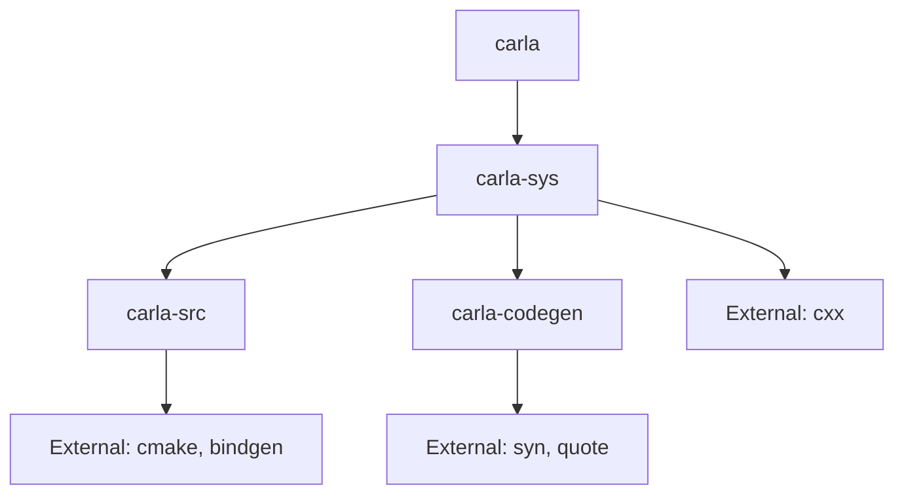

# CARLA Rust Client Architecture

## Overview

The CARLA Rust client provides safe, ergonomic Rust bindings for the CARLA autonomous driving simulator. The architecture follows a layered approach with clear separation of concerns and modern Rust best practices.

## Crate Architecture

```
carla-rust/
├── carla-src/          # CARLA source management and CMake integration
├── carla-sys/          # Low-level FFI layer and code generation
├── carla-codegen/      # Code generation toolkit
└── carla/              # High-level Rust API (imports from carla-sys)
```

### Layer 1: carla-src
**Purpose**: CARLA source code discovery and build management

- Downloads and manages CARLA C++ source code
- Provides CMake integration for building libcarla-client
- Handles different CARLA versions and configurations
- Supplies prebuilt binaries when available

**Key Features**:
- Environment variable detection (`CARLA_ROOT`)
- Version verification and compatibility checking
- Cross-platform build support
- GitHub releases integration

### Layer 2: carla-sys
**Purpose**: Low-level FFI bindings and code generation

- **FFI Layer**: Uses CXX for safe C++ interoperability
- **Code Generation**: Generates Rust types from Python API YAML specs
- **Bridge Code**: Custom C++ wrappers in `cpp/carla_sys_bridge.cpp`
- **Pre-generated Code**: Ships with generated types for fast builds

**Architecture**:
```
carla-sys/
├── src/
│   ├── ffi.rs              # CXX bridge definitions
│   ├── lib.rs              # Public API exports
│   └── generated/          # Generated types
│       ├── mod.rs          # Conditional exports
│       ├── ffi/            # Real FFI implementations
│       └── stubs/          # Documentation stubs
├── cpp/                    # C++ bridge code
├── include/                # C++ headers
└── build.rs               # Code generation + FFI build
```

**Build Features**:
- `docs-only`: Use stub implementations for docs.rs
- `save-bindgen`: Regenerate pre-generated code

### Layer 3: carla-codegen
**Purpose**: Code generation toolkit and CLI

- **Syn-based AST Generation**: Type-safe code generation
- **YAML Parser**: Parses CARLA Python API documentation
- **Type Resolution**: Maps Python types to Rust equivalents
- **CLI Tool**: Standalone code generation utility

**Core Components**:
```
carla-codegen/
├── src/
│   ├── ast/                # AST builders (syn-based)
│   │   ├── struct_builder.rs
│   │   ├── impl_builder.rs
│   │   ├── trait_builder.rs
│   │   └── doc_builder.rs
│   ├── analyzer/           # Type analysis
│   ├── generator/          # Code generation
│   ├── parser/             # YAML parsing
│   └── bin/cli.rs         # Command-line interface
```

### Layer 4: carla
**Purpose**: High-level Rust API

**Current State**: Imports generated types from carla-sys
**Future State**: Minimal wrapper focused on ergonomic API

```rust
// Current approach
pub use carla_sys::generated::*;

// Future approach (recommended)
use carla_sys::generated::Actor as SysActor;

pub struct Actor {
    inner: SysActor,
    // Additional Rust-specific functionality
}
```

## Code Generation Flow

### Phase 1: YAML Analysis
1. Parse CARLA Python API YAML files (`PythonAPI/docs/*.yaml`)
2. Build inheritance hierarchy and dependency graph
3. Resolve type mappings (Python → Rust)
4. Validate class and method definitions

### Phase 2: AST Generation
1. **Struct Generation**: Create Rust structs with proper derives
2. **Impl Generation**: Generate method stubs with FFI placeholders
3. **Documentation**: Rich docs with examples and warnings
4. **Trait Derivation**: Intelligent trait selection based on field types

### Phase 3: Code Output
1. **FFI Variants**: Real implementations calling C++ code
2. **Stub Variants**: Documentation stubs with `unreachable!()`
3. **Formatting**: prettyplease integration for clean output
4. **Module Organization**: Hierarchical module structure

## Build System Integration

### Normal Development Build
```bash
make build  # Uses pre-generated code, no CARLA_ROOT needed
```

### Maintainer Code Regeneration
```bash
export CARLA_ROOT=/path/to/carla-source
cargo build --features save-bindgen  # Regenerates code
```

### Documentation Build (docs.rs)
```bash
cargo build --features docs-only  # Uses stubs, no FFI
```

## Key Design Principles

### 1. **Separation of Concerns**
- carla-sys: Low-level, unsafe, minimal
- carla: High-level, safe, ergonomic
- carla-codegen: Build-time tool, standalone

### 2. **Build Reliability**
- Pre-generated code for fast, reliable builds
- No CARLA source required for normal development
- Fallback stubs for documentation builds

### 3. **Type Safety**
- Syn-based AST generation (compile-time validated)
- Zero-copy wrappers where possible
- Rust ownership and borrowing enforced

### 4. **Developer Experience**
- Rich documentation with examples
- Clear error messages with context
- Comprehensive examples and tests

### 5. **Maintainability**
- Modular architecture with clear boundaries
- Extensive test coverage
- Automated tooling for updates

## Hybrid Architecture Design

### Current Challenges

#### **Documentation Navigation Problem**
When users see `pub use carla_sys::generated::Actor` in the carla crate, IDE navigation takes them to carla-sys instead of finding documentation in the carla crate where they expect it.

#### **Mixed Ownership Problem**
Current approach creates a confusing mix of:
- `carla_sys::generated::Actor` (generated types)
- `carla::client::Client` (handwritten types)
- `carla::actor::ActorExt` (trait extensions)

### Hybrid Architecture Solution

The hybrid approach combines code generation with ergonomic Rust APIs through three patterns:

#### **1. Mirror/Wrapper Pattern (Complex Types)**
For types with significant behavior and state management:

```rust
// Generated in carla-sys/src/generated/actor.rs
pub struct Actor {
    pub id: u32,
    pub type_id: String,
}

// Wrapper in carla/src/actor.rs  
pub struct Actor {
    inner: carla_sys::generated::Actor,
    world_ref: std::sync::Weak<crate::World>,
}

impl Actor {
    // Delegate to generated implementation
    pub fn get_velocity(&self) -> crate::Result<Vector3D> {
        self.inner.get_velocity()
    }
    
    // Add ergonomic Rust API
    pub fn velocity(&self) -> crate::Result<Vector3D> {
        self.get_velocity()
    }
    
    // Add carla-specific functionality
    pub fn world(&self) -> Option<std::sync::Arc<crate::World>> {
        self.world_ref.upgrade()
    }
}
```

#### **2. Trait Extension Pattern (Simple Types)**
For simple data types and value objects:

```rust
// Re-export generated type
pub use carla_sys::generated::Transform;

// Add functionality via traits
pub trait TransformExt {
    fn translate(&self, offset: Vector3D) -> Transform;
    fn distance_to(&self, other: &Transform) -> f32;
    fn forward_vector(&self) -> Vector3D;
}

impl TransformExt for Transform {
    // Implementation
}
```

#### **3. Pure carla Types (New Functionality)**
For carla-specific functionality not in CARLA Python API:

```rust
pub struct ActorCollection {
    actors: Vec<Actor>,
    world: std::sync::Weak<World>,
}

impl ActorCollection {
    pub fn vehicles(&self) -> impl Iterator<Item = &Actor> {
        self.actors.iter().filter(|a| a.is_vehicle())
    }
}
```

## Error Handling Architecture

### Error Types

Each crate defines its own error types appropriate to its layer:

#### carla-codegen Errors
```rust
// Code generation errors
pub enum CodegenError {
    YamlParse(String),
    TypeResolution(String),
    SynGeneration(String),
    IoError(std::io::Error),
}
```

#### carla-sys Errors
```rust
// FFI layer errors
pub enum FfiError {
    CxxException(String),
    NullPointer,
    InvalidUtf8,
    ConversionError(String),
}
```

#### carla Errors (User-facing)
```rust
// High-level API errors
pub enum CarlaError {
    ConnectionFailed(String),
    ActorNotFound(ActorId),
    InvalidBlueprint(String),
    SimulationError(String),
    // Wrap lower-level errors
    Ffi(carla_sys::FfiError),
}
```

### Error Module Convention

Generated code expects a standardized error module:

```rust
// In carla-sys/src/error.rs or carla/src/error.rs
pub mod error {
    use thiserror::Error;
    
    #[derive(Debug, Error)]
    pub enum CarlaError {
        // Crate-specific variants
    }
    
    pub type Result<T> = std::result::Result<T, CarlaError>;
}
```

### Error Propagation

Errors flow upward through the layers:

1. **C++ Exception** → Caught by CXX bridge
2. **FfiError** → Created in carla-sys
3. **CarlaError** → Wrapped in carla crate
4. **User Code** → Receives high-level error

Example flow:
```rust
// In carla-sys (generated)
pub fn spawn_actor_ffi() -> Result<SharedPtr<ffi::Actor>> {
    // CXX bridge catches C++ exceptions
    match ffi::World_spawn_actor() {
        Ok(ptr) if !ptr.is_null() => Ok(ptr),
        Ok(_) => Err(FfiError::NullPointer),
        Err(e) => Err(FfiError::CxxException(e.to_string())),
    }
}

// In carla (high-level)
pub fn spawn_actor() -> Result<Actor> {
    carla_sys::spawn_actor_ffi()
        .map(|ptr| Actor::from_ffi(ptr))
        .map_err(|e| CarlaError::Ffi(e))
}
```

### Error Context

Rich error messages with context:

```rust
// Bad
Err(CarlaError::InvalidParameter)

// Good  
Err(CarlaError::InvalidBlueprint(
    format!("Blueprint '{}' not found in library", blueprint_id)
))
```

### Testing Error Conditions

Generated test harness includes minimal error module:

```rust
// In test crate
pub mod error {
    pub type Result<T> = std::result::Result<T, Box<dyn std::error::Error>>;
}
```

## Future Evolution

### Short Term
- Implement hybrid architecture with wrapper types and trait extensions
- Maintain comprehensive API coverage through code generation
- Focus on ergonomic Rust API design with clear ownership

### Long Term
- Async/await support for non-blocking operations
- Integration with Rust ecosystem (tokio, serde)
- Advanced type-safe configuration builders
- Custom derive macros for user types

## Inter-Crate Dependencies



**Build Dependencies**:
- carla-sys build-depends on carla-codegen (code generation)
- carla-sys build-depends on carla-src (CARLA library)
- carla runtime-depends on carla-sys (FFI types)

**Development Dependencies**:
- All crates use shared tooling (clippy, rustfmt)
- Integration tests span multiple crates
- Examples demonstrate full stack usage